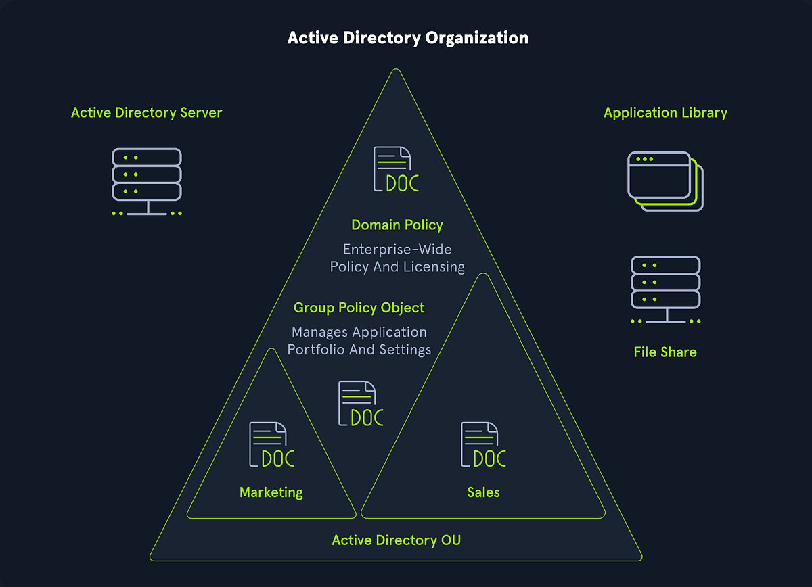

## What is Active Directory?

Active Directory also known as (AD) is a Microsoft directory service and identify management 
for Windows domain networks that are centrally stores information about users, computers, and 
networks resources
It helps organizations:
-Control specific access to different resources
-Enforce security policies
-Simplify adminstration

--
## Active Directory Domain Services Intstallation

